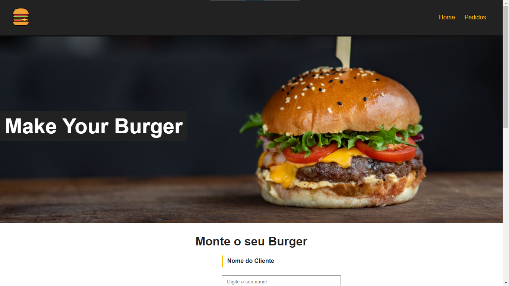
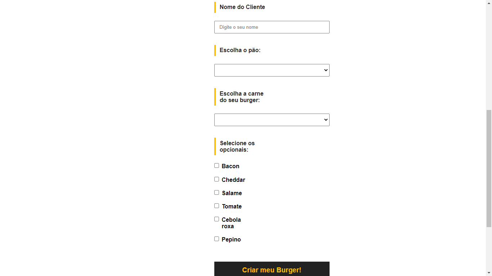
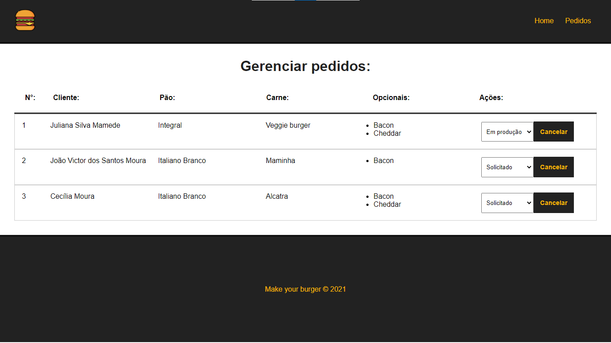

# Burger Store🍔

Este projeto trata-se de um sistema de pedidos para uma hambuergueria, possuindo uma página para realização do pedido e uma página para conferir os pedidos feitos.

## Caso você queira analisar o projeto em sua maquina, siga esses passo a passo 😁

<br>

### Clone o repositório😎

```
git clone https://github.com/jovimoura/burger-store
```

### Acesse o diretorio🤓

```
cd <nome-da-pasta>
```
### Instale as dependências🤠
```
npm install
```
### Inicie a aplicação🤩
```
npm run serve
```

### Inicie o backend 😉

```
npm run backend
```
### O site fica na porta:🤗

```
http://localhost:8080/
```

## Como foi feito?🤔

<p>Para realização do projeto, foram utilizados o Vue-Router, Json-serve, para rodar um mini banco de dados, CSS para estilização e JavaScript para métodos e funções do projeto!</p>
<p>
O projeto possui duas páginas, sendo a primeira página, a home e a segunda, a página de pedidos. Na primeira página temos um formulário que você irá utilizar para montar seu hamburguer e para enviar o pedido ao "banco" e na parte de pedidos, possuimos uma tabela que consome os dados desse banco e na mesma tabela possuímos funções para edição e remoção de pedidos.
</p>

## Imagens do projeto 💻







## Tecnologias utilizadas🦉

<ul>
    <li>VueJS 3</li>
    <li>Router-link</li>
    <li>Json-serve</li>
    <li>JavaScript</li>
    <li>HTML</li>
    <li>CSS</li>
</ul>

## Autor😃

### João Victor dos Santos Moura
### E-mail: joaovictors.mouraa@gmail.com
### Linkedin: https://www.linkedin.com/in/jovimoura10/